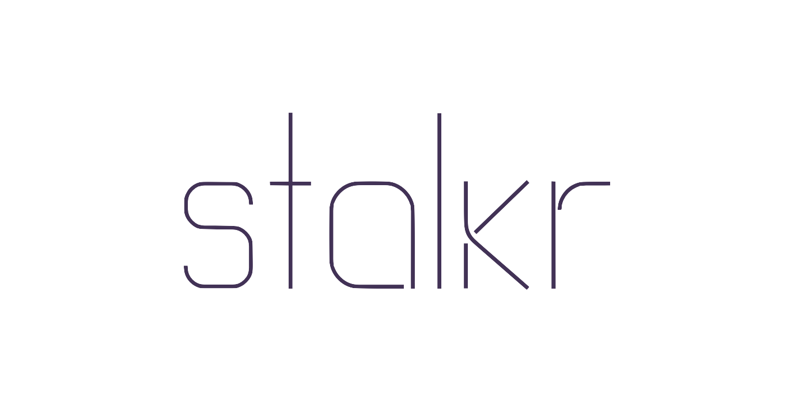
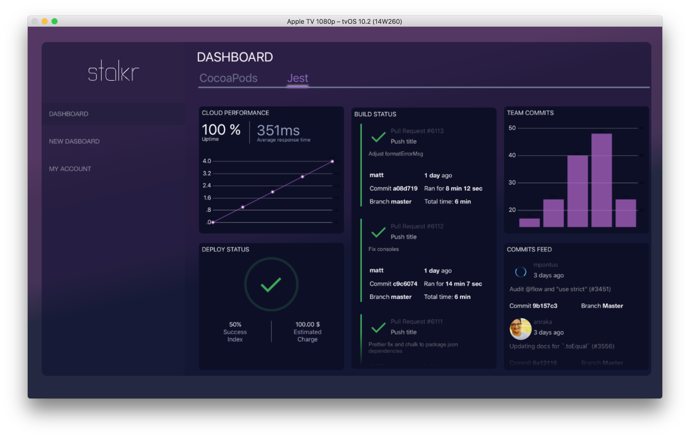

<p align="center">
	
</p>

<br>
<br>

<p align="center">
	Simple micro service which handles emails sent via <a href="http://getstal.kr/#get-in-touch">our page</a>.
</p>

<br>

---

## Table of Contents

<!-- DO NOT EDIT THE COMMENTS BELOW -->

<!-- toc -->

- [Getting Started](#getting-started)
- [Our Product](#our-product)

<!-- tocstop -->

## Getting Started

1. Make sure you define the `ENV` variables below:

    ```sh
    # Mailgun credentials
    export DOMAIN='<your Mailgun sandbox URL>'
    export KEY='<your Mailgun key>'

    # Your email
    export EMAIL_DEST_USER='<the email address you want the messages to be sent to>'
    ```

1. Clone this repository:

    ```sh
    git clone https://github.com/stalkr-io/email-sender
    ```

1. Install all dependencies:

    ```sh
    # via npm
    npm install
    # or using yarn
    yarn
    ```

1. Launch it:

    ```sh
    # via npm
    npm start
    # or using yarn
    yarn start
    ```

If everything goes okay, it should now be running at [`localhost:3000`](http://localhost:3000).

Then you can deploy it to your favorite *{ P, B, F }aaS* service.

## Our Product

<p align="center">
	
</p>

*stalkr* is a simple–yet powerful–set of tools which gathers data from both continuous integration and application infrastructure monitoring tools in order to make it easier to monitor the whole developing process, in a way the entire team can see at a glance, from the very first commit to the final release.

Although our experimental release is a simple client made for the  TV, we do intend to make *stalkr* clients available on as much platforms as possible, which include:

- Other **Smart TV** platforms–e.g. Android TV, webOS, Tizen etc.;

- **SmartWatch** platforms–e.g. watchOS, Android Wear etc.;

- Popular **Mobile** platforms–e.g. iOS, Android etc.;

- Popular **Desktop** OSs–e.g. macOS, Linux, Windows etc.;

- The **Web** itself.

If you can't wait to check it out:

<p align="center">
  <a href="https://itunes.apple.com/br/app/.../...">
    
  </a>
</p>

---

**Maintainer**:

> [ythecombinator.me](https://ythecombinator.me) &nbsp;&middot;&nbsp;
> GitHub [@ythecombinator](https://github.com/ythecombinator) &nbsp;&middot;&nbsp;
> Twitter [@ythecombinator](https://twitter.com/ythecombinator)
